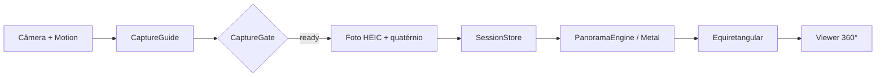

<p align="center">
  
</p>

<p align="center">
  <strong>Captura 360° guiada no iPhone</strong> — pontos no espaço, disparo automático, stitch Metal e viewer interativo.
</p>

<p align="center">
  <a href="https://github.com/Igorrv/panorama360/actions/workflows/build-ipa.yml"></a>
  
  
  
  
  <a href="https://github.com/Igorrv/panorama360/releases"></a>
</p>

<p align="center">
  <a href="#instalar-sem-mac-windows">Instalar no Windows</a> ·
  <a href="#instalar-com-mac">Instalar com Mac</a> ·
  <a href="docs/Sistema.md">Como funciona</a> ·
  <a href="docs/Architecture.md">Arquitetura</a> ·
  <a href="#baixar-o-ipa">Baixar IPA</a>
</p>

---

## O que é

**Panorama360** transforma um iPhone comum numa câmera 360°: você gira no lugar, o app guia com pontos flutuantes sobre a câmera, dispara sozinho quando está alinhado/estável/nítido, costura tudo numa imagem equiretangular e abre um viewer Metal (arrastar, pinça, giroscópio).

| Incluído na v1 | Fora de escopo (por enquanto) |
|----------------|-------------------------------|
| Onboarding + primeira sala (8 pontos) | Login / feed / social |
| Captura guiada + auto-shutter | Marketplace / tokens |
| Stitch Metal (orientação ARKit/CoreMotion) | Backend / nuvem / IA |
| Viewer 360° interativo | OpenCV (opcional — ver docs) |

---

## Destaques

- **Guia visual** — esfera de pontos projetada no preview ao vivo
- **Disparo inteligente** — `CaptureGate` (ângulo + estabilidade + foco + nitidez)
- **Stitch determinístico** — warp pela orientação conhecida, sem feature-matching cego
- **Viewer GPU** — shaders Metal na esfera equiretangular
- **Windows-friendly** — IPA na nuvem (Actions) + Sideloadly no PC
- **Diagnóstico** — `CrashReporter` persiste a última falha (útil em sideload sem Mac)

---

## Pipeline



1. Preview em tela cheia  
2. Pontos: verde → amarelo → azul (alinhado)  
3. Retículo verde + aparelho parado → foto automática  
4. Último ponto → stitch → viewer  

Detalhes: [`docs/Sistema.md`](docs/Sistema.md) · [`docs/Architecture.md`](docs/Architecture.md)

---

## Baixar o IPA

Cada push em `main` gera um artifact **não assinado**:

1. Abra **[Actions → Build IPA](https://github.com/Igorrv/panorama360/actions/workflows/build-ipa.yml)**  
2. Entre no run **verde** mais recente  
3. Baixe **Panorama360-unsigned-ipa** → descompacte → `Panorama360-unsigned.ipa`

> Repo **público** = minutos macOS do Actions ilimitados e grátis.

---

## Instalar sem Mac (Windows)

```text
IPA (Actions)  →  Sideloadly + Apple ID  →  USB  →  Trust no iPhone
```

Guia completo: **[`docs/InstallingOnWindows.md`](docs/InstallingOnWindows.md)**

Instalação grátis dura **7 dias** (limite do Apple ID). Reinstale o IPA para renovar.

---

## Instalar com Mac

```bash
brew install xcodegen
cd Panorama360
xcodegen generate
open Panorama360.xcodeproj
```

Assine com sua Team → iPhone físico → ⌘R.  
Guia: [`docs/BuildingOnMac.md`](docs/BuildingOnMac.md)

> O simulador **não** serve (sem câmera / ARKit).

---

## Stack

| Item | Valor |
|------|--------|
| UI | SwiftUI |
| Captura | AVFoundation · CoreMotion · (ARKit opcional no path alternativo) |
| Stitch / Viewer | Metal · CoreImage · Accelerate |
| Arquitetura | MVVM + Clean + Swift Concurrency |
| iOS mínimo | **16.0** (iPhone) |
| Bundle ID | `com.teleport.panorama360` |
| Projeto Xcode | [XcodeGen](https://github.com/yonaskolb/XcodeGen) ← `project.yml` |

---

## Estrutura

```text
Panorama360/
├─ project.yml
├─ .github/workflows/build-ipa.yml
├─ docs/          Sistema · Architecture · install guides
└─ Panorama360/
   ├─ App/           @main · AppRouter · onboarding
   ├─ Domain/        modelos puros
   ├─ Device/        Camera · Motion · AR · CaptureGate
   ├─ Guide/         esfera de pontos + alinhamento
   ├─ Panorama/      stitch Metal (+ OpenCV opcional)
   ├─ Viewer/        renderer Metal + shaders
   ├─ Presentation/  ViewModels
   ├─ UI/            SwiftUI (Onboarding, Capture, Viewer…)
   └─ Utilities/     storage · crash · blur · math
```

---

## Documentação

| Doc | Conteúdo |
|-----|----------|
| [Sistema.md](docs/Sistema.md) | Produto e pipeline (PT) |
| [Architecture.md](docs/Architecture.md) | Camadas, gate, concorrência |
| [BuildingOnMac.md](docs/BuildingOnMac.md) | XcodeGen + signing |
| [InstallingOnWindows.md](docs/InstallingOnWindows.md) | Actions + Sideloadly |
| [OpenCVIntegration.md](docs/OpenCVIntegration.md) | Stitcher opcional |
| [CONTRIBUTING.md](CONTRIBUTING.md) | PRs e estilo |
| [CHANGELOG.md](CHANGELOG.md) | Histórico de versões |

---

## Qualidade da captura

Gire **devagar**, boa luz, telefone **na vertical** na altura do peito. Sobreposição entre pontos importa mais do que velocidade.

## Licença

[MIT](LICENSE) © Teleport / Panorama360 contributors
